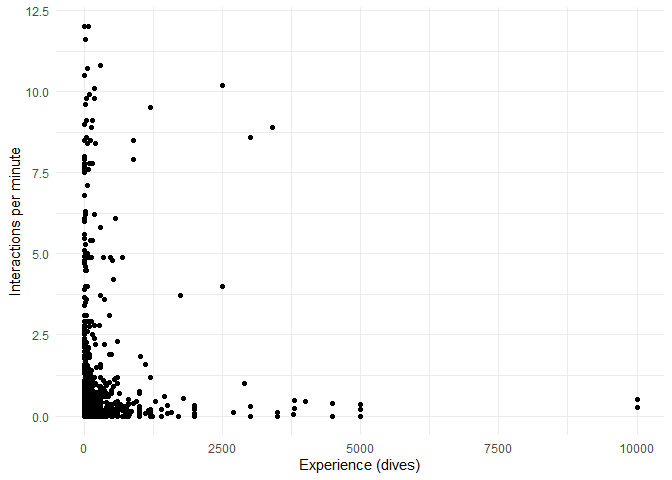
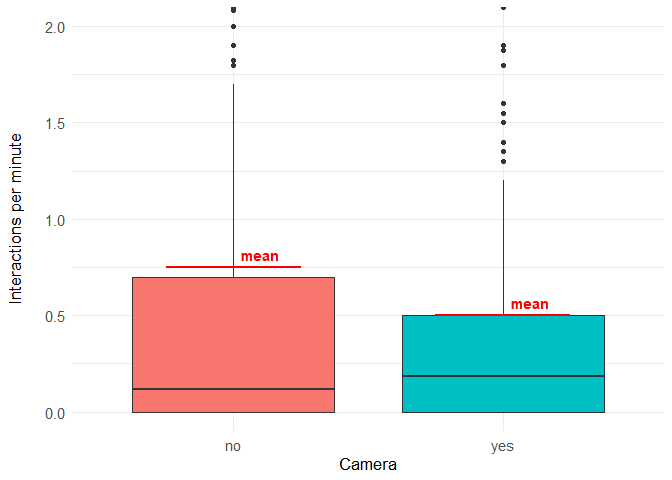
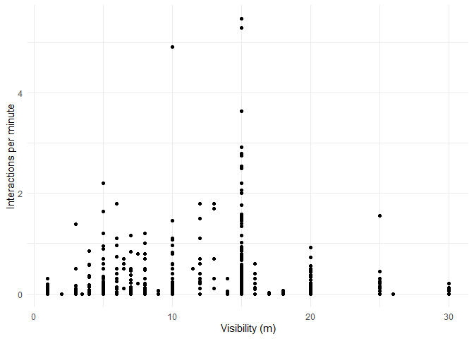
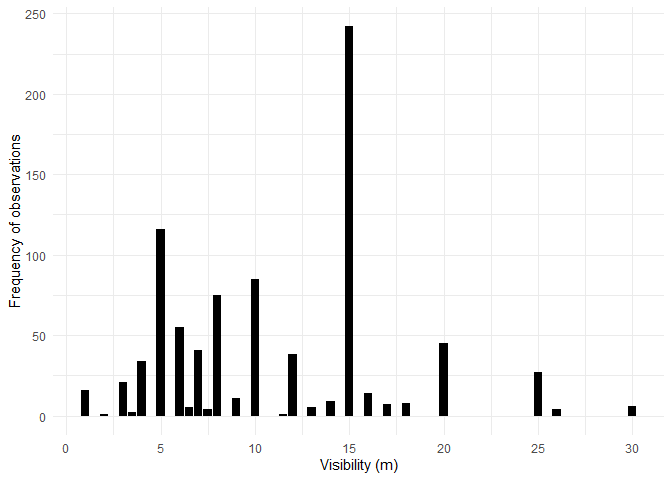

# DiverReef Data Exploration in R

#### April 2024.

### This personal project aims to solidify and enhance my proficiency in R programming through practical data exploration.

Table of Contents:

- [Introduction](#introduction)
  - [Motivation](#motivation)
  - [The Data](#the-data)
  - [Getting Started](#getting-started)
- [Data Cleaning](#data-cleaning)
  - [Cleaning the “Location” Table](#cleaning-the-location-table)
  - [Cleaning the “Behavior” Table](#cleaning-the-behavior-table)
- [Data Exploration](#data-exploration)
  - [Joining Tables](#joining-tables)
  - [Analysis Overview](#analysis-overview)
  - [Scuba Diving vs Snorkeling](#scuba-diving-vs-snorkeling)
  - [Marine Protected Areas vs
    non-MPAs](#marine-protected-areas-vs-non-mpas)
  - [Experience and Number of Interactions
    Correlation](#experience-and-number-of-interactions-correlation)
  - [Impact of Diving with Cameras](#impact-of-diving-with-cameras)
  - [Impact of Visibility Conditions](#impact-of-visibility-conditions)
  - [Top 10% of Interactions Rates
    Group](#top-10-of-interactions-rates-group)
- [Conclusions](#conclusions)

[**Go to Project Summary**](/readme.md)

## Introduction

### Motivation

After familiarizing myself with R, I sought to gain hands-on experience
to both cement my existing skills and improve them. Given my background
in the diving industry, it felt natural to search for a diving-related
dataset to analyze. I found a dataset documenting divers’ physical
interactions with the environment while diving, which intrigued me due
to its relevance to my experiences and interest in environmental impact.
Having observed similar research endeavors in the past, I’ve often
wondered about the outcomes they yielded.

This document serves as a report, detailing the processes and analyses
conducted on this dataset. It includes a description of my methodology,
reasoning, and the R code used. The project comprises two main sections:
data cleaning, covering two different tables, and exploratory analysis.

[Back to Top](#diverreef-data-exploration-in-r)

### The Data

The data is provided by Giglio (2023), and his own description of the
dataset is as follows:

> The DiverReef database provides the first public dataset on the
> underwater behavior of recreational divers in shallow reef
> environments (\< 25 m depth) globally and their interactions with the
> reef seascape and/or reef benthic sessile organisms. The dataset
> comprises 20 years of data (2004-2023) by observing the behavior of
> 2312 recreational divers in 9 countries at 19 diving destinations and
> 179 diving sites. The data were collected through on-site observation
> of divers’ behavior during tourism activities and their physical
> interactions with the reef structure and/or benthic reef sessile
> organisms. Observers discretely followed divers and recorded their
> behavior and interactions with the reef over set time periods. The
> interaction was categorized as “contact” or “damage”, the latter
> occurring when physical damage to the reef benthos was observed.
> Besides behavior, observers also recorded data on the type of diving
> activity (scuba or snorkeling), profiles of the divers (gender and
> experience), use of cameras by the divers, visibility, type of reef
> formation, and marine protection status of the dive site.

It is also important to point out that, according to the author:

> No copyright restrictions apply to the use of this dataset, other than
> citing this publication.

***Giglio, V. (2023). DiverReef: A global database of the behavior of
recreational divers and their interactions with the reef \[Data set\].
In Ecology. Zenodo.***
[](https://doi.org/10.5281/zenodo.10154560)

The version of the dataset I am using (v1, Oct 17, 2023) consists of two
different tables: *DiverReef_behavior_data.csv* and
*DiverReef_location_information.csv*.

I find that data collection like this, is not an easy task and is
subject to mistakes. In my experience witnessing similar research in the
field, it’s typically conducted by various individuals, and in the case
of this dataset, in different countries and by different groups of
researchers.

I can’t ascertain the extent to which these researchers standardized
their processes, but it would be interesting to inquire about this.
Nonetheless, the fact that they agreed to combine the data they
collected suggests that they believe it fits together reasonably well
and isn’t entirely non-standardized. Personally, I’m grateful that
someone took the time to conduct this research and assemble this
dataset.

[Back to Top](#diverreef-data-exploration-in-r)

### Getting Started

I’ll begin by loading the libraries I need to work with this data. I’ll
be using libraries that are all part of the “tidyverse”.

``` r
library(readr)
library(tidyr)
library(dplyr)
library(stringr)
library(purrr)
library(ggplot2)

cat("libraries loaded")
```

    ## libraries loaded

Now that I have the necessary tools, I’ll load the data into RStudio.
I’ll name the *DiverReef_behavior_data* table as `behavior`, and the
*DiverReef_location_information* table as `location`.

``` r
# read .csv files, dataset has ";" as delimiter
location <- read_delim("original-data/DiverReef_location_information.csv",
                        delim = ";")
behavior <- read_delim("original-data/DiverReef_behavior_data.csv",
                       delim = ";")

cat("data loaded")
```

    ## data loaded

I’m all set to begin cleaning these tables and then delve into
exploratory analysis.

[Back to Top](#diverreef-data-exploration-in-r)

## Data Cleaning

### Cleaning the “Location” Table

I’ll start by cleaning the `location` table. To do that, I’ll first take
a look at its current state.

``` r
glimpse(location)
```

    ## Rows: 2,312
    ## Columns: 13
    ## $ source       <chr> "jimenez_gutierrez_et_al_2009", "jimenez_gutierrez_et_al_…
    ## $ diver_id     <dbl> 1, 2, 3, 4, 5, 6, 7, 8, 9, 10, 11, 12, 13, 14, 15, 16, 17…
    ## $ activity     <chr> "scuba", "scuba", "scuba", "scuba", "scuba", "scuba", "sc…
    ## $ month        <chr> "april", "april", "april", "april", "july", "july", "july…
    ## $ year         <dbl> 2004, 2004, 2004, 2004, 2004, 2004, 2004, 2004, 2004, 200…
    ## $ country      <chr> "spain", "spain", "spain", "spain", "spain", "spain", "sp…
    ## $ site         <chr> "benidorm", "benidorm", "benidorm", "benidorm", "benidorm…
    ## $ longitude    <chr> "38.535.367", "38.535.367", "38.535.367", "38.535.367", "…
    ## $ latitude     <chr> " -0.126224", " -0.126224", " -0.126224", " -0.126224", "…
    ## $ mpa          <chr> "yes", "yes", "yes", "yes", "yes", "yes", "yes", "yes", "…
    ## $ dive_site    <chr> "la_llosa", "la_llosa", "la_llosa", "la_llosa", "la_llosa…
    ## $ reef_type    <chr> "rocky_reef", "rocky_reef", "rocky_reef", "rocky_reef", "…
    ## $ visibility_m <chr> NA, NA, NA, NA, NA, NA, NA, NA, NA, NA, NA, NA, NA, NA, N…

Looking at the column names, they all appear to be in order.

Upon reviewing the displayed data, I noticed a discrepancy: some entries
in the *longitude* and *latitude* fields contain two decimal points,
which is not standard for coordinate data. I’ll address this issue
before proceeding with further cleaning.

After examining some coordinates, it appears that the second decimal
point is an erroneous input. When I remove it, the coordinates match the
described locations (*site*) in those records. Therefore, I’ll create a
function to remove the second decimal point when it exists and apply it
to those columns.

For a brief section of the subsequent descriptions, I’ll change the name
of the data frame a couple of times to demonstrate an issue that arises
during the cleaning process.

``` r
# define function to replace 2nd instance of ".", if it exists
replace_second_period <- function(string) {
  # store all positions of "." from the input string
  positions <- str_locate_all(string, fixed("."))[[1]][, "start"]
  # check if string has more than one "."
  if (length(positions) >= 2) {
    # concatenate part before the second "." with part after it
    string <- str_sub(string, 1, positions[2] - 1) %>%
      str_c(str_sub(string, positions[2] + 1))
  }
  return(string)
}

# apply function to longitude and latitude columns
location2 <- location %>%
  mutate(
    longitude = map_chr(longitude, replace_second_period),
    latitude = map_chr(latitude, replace_second_period)
  )
```

I’d like to verify if the *replace_second_period()* function worked. If
successful, all entries in both of these columns should have exactly one
decimal point. To perform this check, I will count the decimal points in
each entry. The function *str_count()* returns a vector with the number
of decimal points in each entry. If they are all “1”, then there should
only be one unique value in that vector: “1”.”

``` r
# is there only the value "1" in the count vector?
unique(str_count(location2$longitude, fixed("."))) == 1
unique(str_count(location2$latitude, fixed("."))) == 1
```

    ## [1] TRUE
    ## [1] TRUE

I’ll also change the data types of both of these columns to numeric.

``` r
location3 <- location2 %>%
  mutate(longitude = as.numeric(longitude),
         latitude = as.numeric(latitude))
```

    ## Warning: There were 2 warnings in `mutate()`.
    ## The first warning was:
    ## ℹ In argument: `longitude = as.numeric(longitude)`.
    ## Caused by warning:
    ## ! NAs introduced by coercion
    ## ℹ Run `dplyr::last_dplyr_warnings()` to see the 1 remaining warning.

The warning indicates that some entries were forced into NAs. I’ll
investigate this further.

``` r
sum(is.na(location3$longitude))  # total number of NAs in longitude
sum(is.na(location3$latitude))  # total number of NAs in latitude
```

    ## [1] 25
    ## [1] 25

There are 25 records that were coerced in each column, which leads me to
believe it was probably both fields in the same 25 records. I’ll check
where this happened.

``` r
# show only records where longitude is NA
location3 %>% filter(is.na(longitude))
```

    ## # A tibble: 25 × 13
    ##    source   diver_id activity month  year country site  longitude latitude mpa  
    ##    <chr>       <dbl> <chr>    <chr> <dbl> <chr>   <chr>     <dbl>    <dbl> <chr>
    ##  1 renfro_…     2274 scuba    may    2023 usa     flor…        NA       NA yes  
    ##  2 renfro_…     2275 scuba    may    2023 usa     flor…        NA       NA yes  
    ##  3 renfro_…     2276 scuba    may    2023 usa     flor…        NA       NA yes  
    ##  4 renfro_…     2277 scuba    may    2023 usa     flor…        NA       NA yes  
    ##  5 renfro_…     2278 scuba    may    2023 usa     flor…        NA       NA yes  
    ##  6 renfro_…     2279 scuba    may    2023 usa     flor…        NA       NA yes  
    ##  7 renfro_…     2280 scuba    may    2023 usa     flor…        NA       NA yes  
    ##  8 renfro_…     2281 scuba    may    2023 usa     flor…        NA       NA yes  
    ##  9 renfro_…     2282 scuba    may    2023 usa     flor…        NA       NA yes  
    ## 10 renfro_…     2283 scuba    may    2023 usa     flor…        NA       NA yes  
    ## # ℹ 15 more rows
    ## # ℹ 3 more variables: dive_site <chr>, reef_type <chr>, visibility_m <chr>

I’ll revert back to the previous data frame, `location2`, to examine how
these coordinates looked before. I’ll do this by filtering that data
frame based on the *diver_id*s of the affected records.

``` r
# show only records for specific diver_id
location2 %>% filter(diver_id %in% 2274:2298)
```

    ## # A tibble: 25 × 13
    ##    source   diver_id activity month  year country site  longitude latitude mpa  
    ##    <chr>       <dbl> <chr>    <chr> <dbl> <chr>   <chr> <chr>     <chr>    <chr>
    ##  1 renfro_…     2274 scuba    may    2023 usa     flor… 24 57.38N 80 27.3… yes  
    ##  2 renfro_…     2275 scuba    may    2023 usa     flor… 24 57.38N 80 27.3… yes  
    ##  3 renfro_…     2276 scuba    may    2023 usa     flor… 24 57.38N 80 27.3… yes  
    ##  4 renfro_…     2277 scuba    may    2023 usa     flor… 24 57.38N 80 27.3… yes  
    ##  5 renfro_…     2278 scuba    may    2023 usa     flor… 24 57.38N 80 27.3… yes  
    ##  6 renfro_…     2279 scuba    may    2023 usa     flor… 24 57.38N 80 27.3… yes  
    ##  7 renfro_…     2280 scuba    may    2023 usa     flor… 24 57.38N 80 27.3… yes  
    ##  8 renfro_…     2281 scuba    may    2023 usa     flor… 24 57.38N 80 27.3… yes  
    ##  9 renfro_…     2282 scuba    may    2023 usa     flor… 24 59.15N 80 24.5… yes  
    ## 10 renfro_…     2283 scuba    may    2023 usa     flor… 24 59.15N 80 24.5… yes  
    ## # ℹ 15 more rows
    ## # ℹ 3 more variables: dive_site <chr>, reef_type <chr>, visibility_m <chr>

Upon examining the *longitude* and *latitude* columns, it appears that
the records for those *diver_id*s have a different coordinate standard
from the rest of the data. As a precaution, I want to see if my function
to remove the second period affected these records in the original
table. I’ll revert back to the original data frame, `location`, and
compare it to the one after the function was applied, `location2`.

``` r
# filter for desired diver_id, get only columns of interest and show on screen
cat("location\n")
location %>%
  filter(diver_id %in% 2274:2298) %>%
  select(longitude, latitude) %>%
  glimpse()

cat("\nlocation2\n")
location2 %>%
  filter(diver_id %in% 2274:2298) %>%
  select(longitude, latitude) %>%
  glimpse()
```

    ## location
    ## Rows: 25
    ## Columns: 2
    ## $ longitude <chr> "24 57.38N", "24 57.38N", "24 57.38N", "24 57.38N", "24 57.3…
    ## $ latitude  <chr> "80 27.39W", "80 27.39W", "80 27.39W", "80 27.39W", "80 27.3…
    ## 
    ## location2
    ## Rows: 25
    ## Columns: 2
    ## $ longitude <chr> "24 57.38N", "24 57.38N", "24 57.38N", "24 57.38N", "24 57.3…
    ## $ latitude  <chr> "80 27.39W", "80 27.39W", "80 27.39W", "80 27.39W", "80 27.3…

It appears that the *replace_second_period()* function didn’t affect
those particular records, as expected, since there was no second period
in them. Moving on, I need to convert those values to the same standard
of coordinates used throughout the rest of the dataframe. That is, from
Degrees and Decimal Minutes to Decimal Degrees. To do that, I’ll apply
this mathematical function: Decimal Degrees = Degrees + (Minutes / 60).
For North (‘N’) and East (‘E’) coordinates, the values are positive,
while for South (‘S’) and West (‘W’) coordinates, they are negative.

``` r
# define function to convert coordinates
convert_coord <- function(coord) {
  # split the coordinate into parts
  parts <- str_split(coord, " ")[[1]]

  # extract degrees
  degrees <- as.numeric(parts[1])
  # extract minutes and remove letter
  minutes <- as.numeric(str_replace(parts[2], "[NSEW]", ""))

  # determine the sign based on the direction (last character of the string)
  direction <- str_sub(parts[2], -1, -1)
  sign <- if_else(direction %in% c("N", "E"), 1, -1)

  # calculate decimal degrees
  decimal_degrees <- sign * (degrees + minutes / 60)

  return(decimal_degrees)
}
```

Now, I will apply the *convert_coord()* function only to the records
where it is needed. I’ll work with the data frame generated after the
second decimal point was removed, which is `location2`.

``` r
location2 <- location2 %>%
  mutate(
    # apply function when criteria is met
    longitude = map_if(
      longitude,
      ~ str_detect(., "[NSEW]"),  # check if "NSEW" is in the string
      ~ convert_coord(.)  # convert coordinate system if condition above is met
    ),
    # do the same for latitude
    latitude = map_if(
      latitude,
      ~ str_detect(., "[NSEW]"),
      ~ convert_coord(.)
    )
  )

# check that no NAs were introduced
sum(is.na(location2$longitude))
sum(is.na(location2$latitude))
```

    ## [1] 0
    ## [1] 0

Finally, I’ll format *longitude* and *latitude* as numeric.

``` r
location2 <- location2 %>%
  mutate(longitude = as.numeric(longitude),
         latitude = as.numeric(latitude))

# check a slice of results, show a few entries that were in the correct
# coordinate format and a few that were converted
location2 %>%
  filter(diver_id %in% 2270:2278) %>%
  select(longitude, latitude) %>%
  glimpse()
```

    ## Rows: 9
    ## Columns: 2
    ## $ longitude <dbl> 42.35952, 42.35952, 42.35952, 42.35952, 24.95633, 24.95633, …
    ## $ latitude  <dbl> 10.89499, 10.89499, 10.89499, 10.89499, -80.45650, -80.45650…

Moving on to other fields, I’ll examine *source* next.

``` r
# list unique values in source column
unique(location2$source)

# show type of data
cat("\nClass:\n")
class(location2$source)
```

    ##  [1] "jimenez_gutierrez_et_al_2009" "luna_et_al_2009"             
    ##  [3] "camp_and_fraser_2012"         "moity_et_al_2019"            
    ##  [5] "giglio_et_al_2016"            "roche_et_al_2016"            
    ##  [7] "giglio_et_al_2018"            "lucrezi_et_al_2021"          
    ##  [9] "saliba_et_al_2022"            "grillo_ana"                  
    ## [11] "balzaretti_merino_et_al_2021" "mcbride_2021"                
    ## [13] "casoli_edoardo"               "giglio_et_al_2022"           
    ## [15] "toso_et_al_2022"              "renfro_bobbie"               
    ## 
    ## Class:
    ## [1] "character"

Everything appears to be correct. Next, I’ll focus on *diver_id*.

``` r
length(unique(location2$diver_id))  # check number of unique diver_id
class(location2$diver_id)

# check the range of values in diver_id
min(location2$diver_id)
max(location2$diver_id)
```

    ## [1] 2312
    ## [1] "numeric"
    ## [1] 1
    ## [1] 2312

The number of unique IDs matches the number of records, and they fall
within the expected range. Next, I’ll examine *activity*.

``` r
unique(location2$activity)
class(location2$activity)
```

    ## [1] "scuba"      "snorkeling" "Scuba"     
    ## [1] "character"

There are two different spellings for the scuba diving *activity*, one
with the “s” capitalized and the other not. While correcting this, I’ll
also format *activity* as a factor.

``` r
location2 <- location2 %>%
  mutate(
    activity = activity %>%  # in the activity column, do the following:
      case_match(
        "Scuba" ~ "scuba",  # rename Scuba as scuba
        .default = activity  # don't change any of the others
      ) %>%
      as.factor()  # format as factor
  )

unique(location2$activity)
```

    ## [1] scuba      snorkeling
    ## Levels: scuba snorkeling

The *month* field should also be formatted as a factor.

``` r
unique(location2$month)

cat("\nClass:\n")
class(location2$month)
```

    ##  [1] "april"     "july"      "october"   "may"       "june"      "august"   
    ##  [7] "september" "november"  NA          "december"  "january"   "february" 
    ## [13] "na"        "march"    
    ## 
    ## Class:
    ## [1] "character"

It appears there is a misplaced character value “na” in this column.
I’ll fix that, format it as a factor, and reorder the levels.

``` r
location2 <- location2 %>%
  mutate(
    month = month %>%
      # substitute "na" for true NAs
      na_if("na") %>%
      # set levels and order
      factor(levels = c(
        "january", "february", "march", "april", "may", "june",
        "july", "august", "september", "october", "november",
        "december"
      ))
  )

# checking to see result
unique(location2$month)
```

    ##  [1] april     july      october   may       june      august    september
    ##  [8] november  <NA>      december  january   february  march    
    ## 12 Levels: january february march april may june july august ... december

Next, I’ll examine *year*.

``` r
unique(location2$year)
class(location2$year)
```

    ##  [1] 2004 2005 2006 2010 2012 2013 2014 2015 2016 2017 2018 2019 2020 2021 2022
    ## [16] 2023
    ## [1] "numeric"

Everything appears to be correct. Next, I’ll focus on *country*.

``` r
unique(location2$country)

cat("\nClass:\n")
class(location2$country)
```

    ## [1] "spain"       "usa"         "ecuador"     "brazil"      "philippines"
    ## [6] "italy"       "mozambique"  "mexico"      "seychelles" 
    ## 
    ## Class:
    ## [1] "character"

Since these are proper names, I will capitalize them.

``` r
location2 <- location2 %>%
  mutate(
    country = country %>%
      case_match(
        "usa" ~ "USA",  # rename usa to USA
        .default = str_to_sentence(country)))  # capitalize the others

unique(location2$country)
```

    ## [1] "Spain"       "USA"         "Ecuador"     "Brazil"      "Philippines"
    ## [6] "Italy"       "Mozambique"  "Mexico"      "Seychelles"

Next, I’ll examine *site*.

``` r
sort(unique(location2$site))  # sort list of unique site values

cat("\nClass:\n")
class(location2$site)
```

    ##  [1] "abrolhos"                            
    ##  [2] "alcatrazes"                          
    ##  [3] "amp_tor_paterno_shoals"              
    ##  [4] "arraial_do_cabo"                     
    ##  [5] "benidorm"                            
    ##  [6] "fernando_de_noronha"                 
    ##  [7] "florida_keys"                        
    ##  [8] "galapagos_islands"                   
    ##  [9] "giglio_island"                       
    ## [10] "los_arcos"                           
    ## [11] "malapascua"                          
    ## [12] "moalboal"                            
    ## [13] "ponta_do_ouro_partial_marine_reserve"
    ## [14] "porto_cesareo"                       
    ## [15] "portofino"                           
    ## [16] "puerto_galera"                       
    ## [17] "punta_campanella"                    
    ## [18] "seychelles"                          
    ## [19] "sierra_helada_marine_park"           
    ## 
    ## Class:
    ## [1] "character"

Everything appears to be correct. Next, I’ll focus on *mpa*.

``` r
unique(location2$mpa)
class(location2$mpa)
```

    ## [1] "yes" "no" 
    ## [1] "character"

I’d like to format this one as a factor as well.

``` r
location2 <- location2 %>%
  mutate(mpa = as.factor(mpa))

class(location2$mpa)
levels(location2$mpa)
```

    ## [1] "factor"
    ## [1] "no"  "yes"

Next, I’ll examine *dive_site*.

``` r
sort(unique(location2$dive_site))

cat("\nClass:\n")
class(location2$dive_site)
```

    ##   [1] "abobrinha"                "acuario_canon"           
    ##   [3] "acuario_hongo"            "airplane"                
    ##   [5] "airplane_site"            "albatros"                
    ##   [7] "alma_jane"                "altare"                  
    ##   [9] "amp_tor_paterno_shoal"    "anequim"                 
    ##  [11] "aninuan_reef"             "aquarium_three_sisters"  
    ##  [13] "atlantis"                 "ave_maria"               
    ##  [15] "baba.boi"                 "badejo.q"                
    ##  [17] "bahia_de_sta_fe"          "baia_dell_olivetta"      
    ##  [19] "bajo_de_cristo"           "banco"                   
    ##  [21] "bantigue"                 "bartolome"               
    ##  [23] "bartolome-cousins"        "beagle"                  
    ##  [25] "beagle-daphne"            "beagle_y_guy_fawkes"     
    ##  [27] "beehive"                  "blacks"                  
    ##  [29] "booby_rock"               "buraco_das_cabras"       
    ##  [31] "buraco_do_inferno"        "cabeco_das_cordas"       
    ##  [33] "cagarras"                 "cagarras_funda"          
    ##  [35] "cala_cupa"                "cala_mezzo"              
    ##  [37] "canon"                    "canon_quijada"           
    ##  [39] "canyons"                  "cardeiros"               
    ##  [41] "carro_armato"             "casa_del_sindaco"        
    ##  [43] "caverna_da_sapata"        "channel_rock"            
    ##  [45] "chapeirao_sueste"         "cherne"                  
    ##  [47] "coffins_patch"            "colombara"               
    ##  [49] "conch_wall"               "copton_point"            
    ##  [51] "coral_cove"               "coral_garden"            
    ##  [53] "cordilheiras"             "cousins_bartolome"       
    ##  [55] "creche"                   "cristo_degli_abissi"     
    ##  [57] "cueva_del_elefante"       "daphne_gordon"           
    ##  [59] "daphne_minor"             "daphne_y_seymour"        
    ##  [61] "deepslope"                "dolphin_house"           
    ##  [63] "doodles"                  "dragone"                 
    ##  [65] "drop_on"                  "drop_zone"               
    ##  [67] "dungong_wall"             "ernies_cave"             
    ##  [69] "ernies_point"             "ernies_steps"            
    ##  [71] "faca_cega"                "faro"                    
    ##  [73] "farol"                    "Farol"                   
    ##  [75] "fish_sanctuary"           "floreana"                
    ##  [77] "fondeadero"               "forno_beach"             
    ##  [79] "funil"                    "gabbianara"              
    ##  [81] "gato"                     "Geladeira"               
    ##  [83] "Geladeira "               "giant_clams"             
    ##  [85] "gordon-plazas"            "gordon_rocks"            
    ##  [87] "grotta_dei_gamberi"       "grotta_dello_zaffiro"    
    ##  [89] "grotta_eremita"           "grottine"                
    ##  [91] "guy_fawkes_y_daphne"      "house_reef"              
    ##  [93] "il_faro"                  "ilha_do_meio"            
    ##  [95] "ilha_do_meio_trad"        "indiano"                 
    ##  [97] "isla_benidorm"            "isla_mitjana"            
    ##  [99] "isuela"                   "jd.corais"               
    ## [101] "key_largo"                "kilima_steps"            
    ## [103] "la_lea"                   "la_llosa"                
    ## [105] "laguna"                   "lajas"                   
    ## [107] "laje_dois_irmaos"         "le_lastre"               
    ## [109] "lighthouse"               "lingua_da_siriba"        
    ## [111] "low_channel_rock"         "manila_channel"          
    ## [113] "marine_sanctuary"         "mascarat"                
    ## [115] "matacoes"                 "mohawk_deer"             
    ## [117] "monad"                    "monkey_beach"            
    ## [119] "montalto"                 "mosquera"                
    ## [121] "mosquera_norte"           "mosquera_y_daphne"       
    ## [123] "mosquera_y_seymour_canal" "mosquera_y_seymour_norte"
    ## [125] "panagsama_house_reef"     "pedras_secas"            
    ## [127] "pescador"                 "pescador_island"         
    ## [129] "pickles"                  "pink_wall"               
    ## [131] "plazas_n"                 "Portinho"                
    ## [133] "portinho_sul_mato_verde"  "porto_pidocchio"         
    ## [135] "punta_campanella"         "punta_cormoran_champion" 
    ## [137] "punta_di_puolo"           "punta_vessinaro"         
    ## [139] "Raias"                    "raviolo"                 
    ## [141] "red_point"                "rihannas_archkevs_ledge" 
    ## [143] "rocas_beagle"             "rosalinda"               
    ## [145] "saavedra_sanctuary"       "sabang_point"            
    ## [147] "sabang_wrecks"            "santa_fe"                
    ## [149] "scoglio_a_penna"          "scole"                   
    ## [151] "secca_gonzatti"           "seymour"                 
    ## [153] "seymour_canal"            "seymour_gordon"          
    ## [155] "seymour_punta"            "seymur-mosquera"         
    ## [157] "seymur_norte"             "sharks_cave"             
    ## [159] "sky_dive"                 "south_marianne"          
    ## [161] "st_pierre"                "steps"                   
    ## [163] "steves_ledge"             "subbielli"               
    ## [165] "talisay_point"            "tamburo"                 
    ## [167] "targhetta"                "tartaruga"               
    ## [169] "tekno_reef"               "testa_del_leone"         
    ## [171] "texas"                    "the_wall"                
    ## [173] "three_sisters"            "tongo"                   
    ## [175] "torretta"                 "vervece"                 
    ## [177] "west_escocea"             "white_bank"              
    ## [179] "wreck_point"             
    ## 
    ## Class:
    ## [1] "character"

There are several spelling issues in this field:

- Different separators: “\_“,”-” and “.”; for example, “baba.boi”,
  “beagle-daphne”, “bajo_de_cristo”.
- Some entries are are capitalized, for example, “Farol”.
- There are trailing whitespaces, for example, “Geladeira” and
  “Geladeira ”.

I’ll address those problems and verify that the changes were successful.

``` r
location2 <- location2 %>%
  mutate(
    dive_site = dive_site %>%
      str_trim() %>%                # trim trailing whitespaces
      str_to_lower() %>%            # convert to lowercase
      str_replace_all("[-.]", "_")  # replace "-" and "." with underscore
  )

# check for any remaining space ("\s"), dot, dash or capital letter ("A-Z")
any(str_detect(location2$dive_site, "[\\s.-]|[A-Z]"), na.rm = TRUE)
```

    ## [1] FALSE

Next, I’ll examine *reef_type*.

``` r
sort(unique(location2$reef_type))

cat("\nClass:\n")
class(location2$reef_type)
```

    ##  [1] "artificial_reef_shipwreck"                   
    ##  [2] "cave"                                        
    ##  [3] "caves_and_canyons"                           
    ##  [4] "caves_and_gravel"                            
    ##  [5] "coral_reef_barrier_reef"                     
    ##  [6] "deep_forereef_slope"                         
    ##  [7] "flat"                                        
    ##  [8] "flat_and _wall"                              
    ##  [9] "flat_and_caves"                              
    ## [10] "flat_and_smal _pinnacles"                    
    ## [11] "flat_sandstone_reef"                         
    ## [12] "fringe"                                      
    ## [13] "gravel_slopy_bottom"                         
    ## [14] "N/A"                                         
    ## [15] "oligocenic_puddingstone_shoal"               
    ## [16] "oligocenic_puddingstone_vertical_wall"       
    ## [17] "oligocenic_puddingstone_vertical_wall/cavern"
    ## [18] "patch"                                       
    ## [19] "pinnacle"                                    
    ## [20] "rocks_and_gravel"                            
    ## [21] "rocky_reef"                                  
    ## [22] "Rocky_reef"                                  
    ## [23] "rocky_reef-vertical_wall"                    
    ## [24] "rocky_reef_sand-gravelly_ledges"             
    ## [25] "rocky_reef_sand-gravelly_vertical_wall"      
    ## [26] "rocky_reef_sand_gravelly"                    
    ## [27] "rocky_reef_vertical_wall"                    
    ## [28] "rocky_reef_with_ledges_and_vertical_wall"    
    ## [29] "sand_and_cymodocea_meadow"                   
    ## [30] "shallow_backreef"                            
    ## [31] "shoal"                                       
    ## [32] "vertical_wall_rocky_reef"                    
    ## [33] "wall"                                        
    ## [34] "wall_and_cave"                               
    ## [35] "wall_and_gravel"                             
    ## [36] "wall_and_posidonia_meadow"                   
    ## 
    ## Class:
    ## [1] "character"

There are spelling problems in this field as well:

- There are extra spaces in some entries, such as “flat_and \_wall”.
- Different separators are used, such as
  “oligocenic_puddingstone_vertical_wall/cavern” and
  “rocky_reef_sand-gravelly_ledges”.
- Some entries are capitalized, for example, “Rocky_reef”.
- Entries that should be NAs are written as “N/A”.

I’ll apply similar fixes to what I did in the previous column,
*dive_site*.

``` r
location2 <- location2 %>%
  mutate(
    reef_type = reef_type %>%
      na_if("N/A") %>%                  # replace "N/A" with NA
      str_to_lower() %>%                # convert to lowercase
      str_replace_all("[-/]", "_") %>%  # replace "-" and "/" with underscore
      str_replace_all(fixed(" "), "")   # remove all spaces
  )

# check for any remaining space "\s", dash or capital letter "A-Z"
any(str_detect(location2$dive_site, "[\\s-/]|[A-Z]"), na.rm = TRUE)
```

    ## [1] FALSE

Finally, I’ll examine *visibility_m*.

``` r
class(location2$visibility_m)
```

    ## [1] "character"

I’ll format it as numeric and check for unusual values.

``` r
# convert to numeric
location2 <- location2 %>%
  mutate(visibility_m = as.numeric(visibility_m))

# check for unusual values
max(location2$visibility_m, na.rm = TRUE)   # ignore NA values
min(location2$visibility_m, na.rm = TRUE)
```

    ## [1] 30
    ## [1] 1

There were no warnings and I found no unusual values.

This table is now clean and ready for use. I’ll rename it `location`
again, for future use.

``` r
location <- location2
glimpse(location)
```

    ## Rows: 2,312
    ## Columns: 13
    ## $ source       <chr> "jimenez_gutierrez_et_al_2009", "jimenez_gutierrez_et_al_…
    ## $ diver_id     <dbl> 1, 2, 3, 4, 5, 6, 7, 8, 9, 10, 11, 12, 13, 14, 15, 16, 17…
    ## $ activity     <fct> scuba, scuba, scuba, scuba, scuba, scuba, scuba, scuba, s…
    ## $ month        <fct> april, april, april, april, july, july, july, july, july,…
    ## $ year         <dbl> 2004, 2004, 2004, 2004, 2004, 2004, 2004, 2004, 2004, 200…
    ## $ country      <chr> "Spain", "Spain", "Spain", "Spain", "Spain", "Spain", "Sp…
    ## $ site         <chr> "benidorm", "benidorm", "benidorm", "benidorm", "benidorm…
    ## $ longitude    <dbl> 38.53537, 38.53537, 38.53537, 38.53537, 38.53537, 38.5353…
    ## $ latitude     <dbl> -0.126224, -0.126224, -0.126224, -0.126224, -0.126224, -0…
    ## $ mpa          <fct> yes, yes, yes, yes, yes, yes, yes, yes, yes, yes, yes, ye…
    ## $ dive_site    <chr> "la_llosa", "la_llosa", "la_llosa", "la_llosa", "la_llosa…
    ## $ reef_type    <chr> "rocky_reef", "rocky_reef", "rocky_reef", "rocky_reef", "…
    ## $ visibility_m <dbl> NA, NA, NA, NA, NA, NA, NA, NA, NA, NA, NA, NA, NA, NA, N…

Lastly, I’ll save this as an R object so that it can be easily loaded
into different scripts.

``` r
write_rds(location, "clean-data/location_clean.rds")
```

[Back to Top](#diverreef-data-exploration-in-r)

### Cleaning the “Behavior” table

I’ll begin cleaning the `behavior` table by taking a look at its current
state.

``` r
glimpse(behavior)
```

    ## Rows: 2,312
    ## Columns: 8
    ## $ diver_id        <dbl> 1, 2, 3, 4, 5, 6, 7, 8, 9, 10, 11, 12, 13, 14, 15, 16,…
    ## $ sex             <chr> "male", "male", "male", "male", "female", "male", "mal…
    ## $ experience      <dbl> NA, NA, NA, NA, NA, NA, NA, NA, NA, NA, NA, NA, NA, NA…
    ## $ camera          <chr> "no", "no", "no", "no", "no", "no", "no", "no", "no", …
    ## $ samp_timing_min <dbl> 10, 10, 10, 10, 10, 10, 10, 10, 10, 10, 10, 10, 10, 10…
    ## $ damage          <dbl> NA, NA, NA, NA, NA, NA, NA, NA, NA, NA, NA, NA, NA, NA…
    ## $ contact         <dbl> NA, NA, NA, NA, NA, NA, NA, NA, NA, NA, NA, NA, NA, NA…
    ## $ total           <dbl> 2, 5, 2, 8, 12, 11, 3, 12, 10, 18, 2, 3, 10, 15, 7, 10…

I’ll start by renaming some of the columns.

``` r
behavior <- behavior %>%
  rename(
    gender = sex,
    samp_time_min = samp_timing_min,
    total_interactions = total
  )

colnames(behavior)
```

    ## [1] "diver_id"           "gender"             "experience"        
    ## [4] "camera"             "samp_time_min"      "damage"            
    ## [7] "contact"            "total_interactions"

Now onto the columns themselves. First up is *diver_id*. This field is
shared by the two tables, which will be useful for joining these
observations.

``` r
length(unique(behavior$diver_id))  # check number of unique diver_id
class(behavior$diver_id)

# check the range of values in diver_id
min(behavior$diver_id)
max(behavior$diver_id)
```

    ## [1] 2312
    ## [1] "numeric"
    ## [1] 1
    ## [1] 2312

The number of unique IDs matches the number of records, and they fall
within the expected range. Next, I’ll examine *gender*.

``` r
unique(behavior$gender)
class(behavior$gender)
```

    ## [1] "male"   "female" NA      
    ## [1] "character"

This column should be formatted as a factor.

``` r
behavior <- behavior %>%
  mutate(gender = as.factor(gender))  # convert to factor

class(behavior$gender)
```

    ## [1] "factor"

Next, I’ll examine *experience*.

``` r
class(behavior$experience)
min(behavior$experience, na.rm = TRUE)  # ignore NA values
max(behavior$experience, na.rm = TRUE)
```

    ## [1] "numeric"
    ## [1] 1
    ## [1] 10000

The entries range from one dive to ten thousand dives. While ten
thousand dives is a lot, it can be real. I would say that most likely,
the people being surveyed in these records were the dive guides. Next,
I’ll focus on *camera*.

``` r
unique(behavior$camera)
class(behavior$camera)
```

    ## [1] "no"  "yes" NA   
    ## [1] "character"

I’d like to format this one as a factor as well.

``` r
behavior <- behavior %>%
  mutate(camera = as.factor(camera))

class(behavior$camera)
```

    ## [1] "factor"

Next, I’ll examine *samp_time_min*.

``` r
class(behavior$samp_time_min)
min(behavior$samp_time_min, na.rm = TRUE)
max(behavior$samp_time_min, na.rm = TRUE)
```

    ## [1] "numeric"
    ## [1] 5
    ## [1] 72

The format is correct and there are no unusual values. Next, I will
check the last 3 columns of this table: *damage*, *contact* and
*total_interactions*. I’ll verify if they have the appropriate data
types and if their minimum and maximum values make sense.

``` r
cat(" damage:\n")
class(behavior$damage)
min(behavior$damage, na.rm = TRUE)
max(behavior$damage, na.rm = TRUE)

cat("\n contact:\n")
class(behavior$contact)
min(behavior$contact, na.rm = TRUE)
max(behavior$contact, na.rm = TRUE)

cat("\n total_interactions:\n")
class(behavior$total_interactions)
min(behavior$total_interactions, na.rm = TRUE)
max(behavior$total_interactions, na.rm = TRUE)
```

    ##  damage:
    ## [1] "numeric"
    ## [1] 0
    ## [1] 338
    ## 
    ##  contact:
    ## [1] "numeric"
    ## [1] 0
    ## [1] 346
    ## 
    ##  total_interactions:
    ## [1] "numeric"
    ## [1] 0
    ## [1] 684

Some of these maximum values look excessive, so I will explore these
fields further.

From this point on, it is important to remember how these fields were
defined by the dataset: “The data were collected through on-site
observation of divers’ behavior during tourism activities and their
physical interactions with the reef structure and/or benthic reef
sessile organisms. Observers discretely followed divers and recorded
their behavior and interactions with the reef over set time periods.
Interactions were described as”contact” and “damage”, the latter refers
to when physical damage to a benthic organism or the reef structure was
observed.”

I’m assuming that *total_interactions* should be the sum of the
*contact* and *damage* fields recorded by the observers. Examining the
dataset, I find this to be true for almost 75% of cases (1729 out of
2312 records), so I believe my assumption is correct.

Additionally, there are no cases where *total_interactions* is NA, so I
don’t have to worry about that.

``` r
# total number of observations
a <- nrow(behavior)

# count records where damage + contact == total_interactions
b <- nrow(behavior %>% filter(damage + contact == total_interactions))

# percentage of observations where damage + contact == total_interactions
cat("percentage of records where damage + contact == total_interactions:\n")
b / a * 100

# check if there are any records where total_interactions is NA
cat("number of records where total_interactions is NA:\n")
nrow(behavior %>% filter(is.na(total_interactions)))
```

    ## percentage of records where damage + contact == total_interactions:
    ## [1] 74.78374
    ## number of records where total_interactions is NA:
    ## [1] 0

It is important to note that, when performing a logical comparison such
as `damage + contact == total_interactions`, if either of these
variables contains NA values, the result will be NA. Since the
*filter()* function excludes records with NA values in the evaluated
column, applying it to the vector resulting from that logical comparison
effectively filters out any records with NA values in those fields. It
is useful to keep this in mind for the following reasoning.

The obtained results raise the question: “What about the other 25% of
data?”

While ideally, I would speak with the researcher who gathered this data
to gain insight, in this case, I will assess the issue on my own.

One plausible scenario is when both *damage* and *contact* are NAs, but
there is a *total_interactions* value recorded for that observation. In
this scenario, the observers may have only recorded the total number of
interactions and did not make a distinction between damage and contact.
This case accounts for another 332 records, approximately 14% of the
total. So, around 89% of the data have entries in these three fields
that I deem trustworthy.

``` r
# count records where damage AND contact is NA
c <- nrow(behavior %>% filter(is.na(damage) & is.na(contact)))

# percentage of observations where damage AND contact are NA
c / a * 100
```

    ## [1] 14.35986

There are two other scenarios that account for the rest of the data:

- There are recorded values for both *damage* and *contact* (non-NAs),
  and their sum doesn’t add up to *total_interactions*.
- There is a non-NA entry for only one of the two fields: *damage* or
  *contact*.

I cannot see any plausible explanations for the first scenario.

The second scenario could actually contain credible records if they only
had either *damage* or *contact* entries, and that number was equal to
*total_interactions*. In this case, a plausible explanation would be
that there was actually only one of these types of interactions. Or that
the observer counted everything he saw as either damage or contact.

Again using logical operators, I will try to find these cases. I’ll
count the observations in the first scenario and then the second
scenario. Additionally, I’ll check to see if there are any of those
plausible cases I just mentioned within the second scenario. Lastly, I
will verify that I accounted for all of the data.

``` r
# first scenario
# count records where neither damage or contact is NA
# and they don't add up to total_interactions
d <- nrow(behavior %>% filter(damage + contact != total_interactions))

# second scenario: total
# count records where only one of damage or contact is NA
e <- nrow(behavior %>% filter(xor(is.na(damage), is.na(contact))))

# percentage of observations that have no plausible explanation
# for entries in these fields
cat(" percentage where entries in damage, contact or total_interactions don't make sense:\n")
(d + e) / a * 100


# second scenario: special cases
# count records where only one of damage or contact is NA
# AND that field is equal to total_interactions
cat("\n number of plausible records where only one of damage or contact is NA:\n")
nrow(behavior %>%
       filter(xor(is.na(damage), is.na(contact)) &
                ((damage | contact) == total_interactions)))

# did I get everything?
cat("\n did I account for all of the data?\n")
a == b + c + d + e
```

    ##  percentage where entries in damage, contact or total_interactions don't make sense:
    ## [1] 10.8564
    ## 
    ##  number of plausible records where only one of damage or contact is NA:
    ## [1] 0
    ## 
    ##  did I account for all of the data?
    ## [1] TRUE

There were no records that matched the plausible explanation suggested
for the second scenario mentioned above.

That means that approximately 11% of the data most likely has erroneous
entries in the *damage*, *contact* or *total_interactions* fields.

I considered flagging these cases in a new column and leaving them in
the dataset, this way I could still use information from other fields in
these records. But I’m not confident that those fields will be correct
either, since I can’t determine the cause of the errors I just examined.
Instead, I’ve decided to drop the rows containing these observations.

``` r
# select only records where the two conditions reasoned before are met
behavior <- behavior %>%
  filter(
    # if damage + contact == total_interactions OR
    (damage + contact == total_interactions) |
      # if damage AND contact are NA
      (is.na(damage) & is.na(contact)))
```

I’d like to verify if this had an impact on the maximum values of these
fields.

``` r
cat("damage:\n")
max(behavior$damage, na.rm = TRUE)

cat("contact:\n")
max(behavior$contact, na.rm = TRUE)

cat("total interactions:\n")
max(behavior$total_interactions, na.rm = TRUE)
```

    ## damage:
    ## [1] 338
    ## contact:
    ## [1] 346
    ## total interactions:
    ## [1] 684

The results are the same as before. I’ll examine closer the observations
with high values for *total_interactions*. Because of the filter I just
applied, I can confidently say that *total_interactions* will always be
the highest value between *damage*, *contact* and *total_interactions*.

``` r
# check records with high total_interactions numbers
behavior %>%
  filter(total_interactions > 300) %>%  # 300 is arbitrary
  # only for total_interactions to fit in the chunk output in Rstudio
  select(-gender)  
```

    ## # A tibble: 5 × 7
    ##   diver_id experience camera samp_time_min damage contact total_interactions
    ##      <dbl>      <dbl> <fct>          <dbl>  <dbl>   <dbl>              <dbl>
    ## 1      232        150 no                10    169     213                382
    ## 2      238       1400 no                10    179     187                366
    ## 3      240         40 no                10    190     208                398
    ## 4      263        240 no                10    195     211                406
    ## 5      360         70 no                10    338     346                684

Personally, I find that high interaction values like these don’t make
sense for a recreational diver who is not actively working on anything
on the ocean floor. The highest *total_interactions*, 684, was recorded
in a sampling time of 10min, meaning over 1 interaction per second. That
seems unreal for these types of diving operations. Additionally, no
observer could realistically keep up with that level of activity while
taking notes.

There could be hidden reasons for numbers as high as these, but if they
exist, they were not shared. Additionally, they would most likely not
align with the rest of the data anyway, as the dataset’s description
indicates that these are simply observations of divers during regular
tourism activities.

At this point, in a real scenario, I would again seek more information
from the source of the data. However, since additional information is
not available in this case, I will assess this problem independently.

To evaluate these observations and judge which of them are credible, I
believe interactions per minute is a suitable metric. I will create a
new column with this information based on *total_interactions* and
*samp_time_min*.

``` r
behavior <- behavior %>%
  # create interactions_per_min and round to 4 digits
  mutate(interactions_per_min = round(total_interactions / samp_time_min, 4))
```

I also have to decide on a threshold for *interactions_per_min*. There
could be a case where someone touched the reef a lot for a short period
of time, inflating the final *interactions_per_min* value. However,
based on my own experience, anything above 1 interaction every 5 seconds
sounds unreasonable. This number is already very high.

For instance, if someone were to touch the bottom non-stop at a rate of
2 interactions per second for a whole minute, that would amount to 120
interactions. If the observer sampled this person for a short time (for
example, 10 minutes), that would result in 12 interactions per minute,
corresponding to the suggested “1 interaction every 5 seconds.”

There could be exceptions with a higher *interactions_per_min* rate if
the sampling time was shorter then the 10 minutes mentioned. I will
search for such cases by checking the maximum value of
*interactions_per_min* when the sampling time was less than 10 minutes.

``` r
# check max interactions_per_min values when sampling time was less than 10 min
behavior %>%
  filter(samp_time_min < 10) %>%
  summarize(max(interactions_per_min)) %>%
  pull()  # show only the result instead of the data frame
```

    ## [1] 7.7778

This result shows that there is no instance of an *interactions_per_min*
value exceeding 12 for sampling times smaller than 10 minutes. This
indicates that I am not overlooking any cases of exceptionally high
interaction rates because of shorter sampling times.

Given the previous reasoning for using 12 interactions per minute as a
threshold, I will proceed to drop the rows with an
*interactions_per_min* value higher than 12.

``` r
# total number of records that will be dropped
nrow(behavior %>% filter(interactions_per_min > 12))

# selecting only observations with values in interactions_per_min less than 12
behavior <- behavior %>%
  filter(interactions_per_min <= 12)
```

    ## [1] 35

This situation weakens the credibility of this dataset. Ideally these
issues would be investigated. I will keep this in mind when deriving any
insights from this data.

Taking a final look at the `behavior` table:

``` r
glimpse(behavior)
```

    ## Rows: 2,026
    ## Columns: 9
    ## $ diver_id             <dbl> 1, 2, 3, 4, 5, 6, 7, 8, 9, 10, 11, 12, 13, 14, 15…
    ## $ gender               <fct> male, male, male, male, female, male, male, male,…
    ## $ experience           <dbl> NA, NA, NA, NA, NA, NA, NA, NA, NA, NA, NA, NA, N…
    ## $ camera               <fct> no, no, no, no, no, no, no, no, no, no, no, no, n…
    ## $ samp_time_min        <dbl> 10, 10, 10, 10, 10, 10, 10, 10, 10, 10, 10, 10, 1…
    ## $ damage               <dbl> NA, NA, NA, NA, NA, NA, NA, NA, NA, NA, NA, NA, N…
    ## $ contact              <dbl> NA, NA, NA, NA, NA, NA, NA, NA, NA, NA, NA, NA, N…
    ## $ total_interactions   <dbl> 2, 5, 2, 8, 12, 11, 3, 12, 10, 18, 2, 3, 10, 15, …
    ## $ interactions_per_min <dbl> 0.2, 0.5, 0.2, 0.8, 1.2, 1.1, 0.3, 1.2, 1.0, 1.8,…

The `behavior` table has been cleaned and is now ready for use. Finally,
I’ll save this as an R object so that it can be easily loaded into
different scripts.

``` r
write_rds(behavior, "clean-data/behavior_clean.rds")
```

[Back to Top](#diverreef-data-exploration-in-r)

## Data Exploration

### Joining Tables

Now that the data is clean, I’m going to join the two tables to conduct
some exploration.

Although I removed some records from the `behavior` table, performing an
inner join will ensure that only corresponding observations are retained
in the joined table. I’ll name this new joined table `reef`.

``` r
# join tables by diver_id and move source column to the end
reef <- inner_join(location, behavior, by = "diver_id") %>%
  select(-source, everything(), source)
```

[Back to Top](#diverreef-data-exploration-in-r)

### Analysis Overview

Since there may be variations in how interactions are recorded across
studies and among different observers, analyzing location-related
variables could potentially be misleading. For example, a researcher in
Spain may have a different method for recording data compared to a
researcher in Brazil. Therefore, I will avoid conducting analyses that
rely on behavior according to destinations.

Instead, I will focus on variables that are less likely to be influenced
by location differences. For instance, if I were to examine experience
levels, I anticipate that differences in sampling methods would be
smoothed out. This is because conducting an analysis such as comparing
experienced divers to inexperienced divers is likely to include records
from the various researchers in both of these groups, regardless of
their locations.

I’ll verify this right now by examining the frequency distribution of
observations based on experience levels across countries. I expect to
see a similar distribution regardless of location. To visualize this,
I’ll filter for divers with fewer than 400 dives in the *experience*
field. This will enhance the quality of the visualization, as there are
only a few records with more than 400 dives and they could potentially
obscure the results.

``` r
reef %>%
  filter(experience < 400) %>%  # filter for less than 400 dives
  ggplot(aes(x = experience)) +  # set experience to the x-axis
  # set chart type and the number of bins and color
  geom_histogram(bins = 80, fill = "darkblue", ) +
  facet_wrap(~country) +  # facet by country
  labs(
    title = "Histograms of Experience by Country",  # add labels
    x = "Experience (dives)",
    y = "Frequency\n"
  ) +
  theme_minimal() +  # add minimal theme
  theme(plot.title = element_text(hjust = 0.5))  # centralize title
```

<!-- -->

It appears that the distributions of experience levels are similar
across different locations, with most observed divers having fewer
dives, and the number of observations decreasing as experience levels
increase. This trend reflects the typical composition of the diving
community.

To mitigate issues related to research standardization, I can explore
aspects unrelated to researchers’ measurements, such as the distribution
of data collection locations or divers’ experience levels across
destinations. However, for this analysis, my focus is on diver behavior
and their interactions with the environment. As such, I am excluding the
following fields: *country*, *site*, *longitude*, *latitude*,
*dive_site*.

Additionally, since the data spans various studies conducted at
different times and was not collected as a time series, I will not be
conducting any time-series analysis. Therefore, I am also excluding the
*year* and *month* fields.

Furthermore, while the dataset describes differences between *contact*
and *damage*, standardizing these metrics across researchers can be
challenging, and many observations only record the total number of
interactions. Hence, I will focus solely on this total number for
analysis.

I will not distinguish behavior differences based on genders or reef
types. Also, I find that the source of the study does not provide
meaningful information for my analysis, so I am dropping that field as
well.

Since each observation has a unique identifier, *diver_id*, I can always
refer back to the original table to examine these excluded fields if
needed.

``` r
# drop fields that I don't care about for this analysis
reef_exp <- reef %>%
  select(
    -country, -site, -latitude, -longitude, -dive_site, -year, -month,
    -gender, -reef_type, -damage, -contact, -source
  )
```

I will now explore the following points:

- Differentiating behavior between scuba diving and snorkeling.
- Comparing behavior in marine protected areas (MPAs) versus non-MPAs.
- Investigating any correlation between diver experience and the
  frequency of physical interactions.
- Assessing the impact of using cameras on diver behavior towards the
  environment.
- Examining how visibility conditions might influence diver interactions
  with the reef.
- Exploring the profile of the group with the highest recorded
  interaction rates.

These questions reflect my own curiosity as a diver, and I’m eager to
see the results of this analysis.

For these explorations, I will primarily utilize the variable
*interactions_per_min*, as it accounts for the sampling period and
provides a standardized metric for comparison across observations.

It’s important to clarify that **interactions** refers to instances
where the diver made contact with the reef, whether intentionally or
unintentionally. This analysis cannot distinguish between deliberate
reef touching and accidental contact, such as hitting a fin against the
bottom.

[Back to Top](#diverreef-data-exploration-in-r)

### Scuba Diving vs Snorkeling

In this section, I will explore the difference in behavior between scuba
divers and snorkelers, and also delve deeper into the scuba diving
group, which will be the focus of the analysis moving forward.

There’s a significant disparity in the amount of data collected on scuba
diving compared to snorkeling. Specifically, there are 1875 observations
for scuba diving, whereas snorkeling has only 151 observations. Upon
reviewing the original table, `reef`, the snorkeling data originates
from only 3 studies by 2 different sources. I’ll keep this limitation in
mind during my analysis.

``` r
# count observations for each activity type
cat("number of snorkeling observations:\n")
nrow(reef_exp %>% filter(activity == "snorkeling"))

cat("number of scuba observations:\n")
nrow(reef_exp %>% filter(activity == "scuba"))

cat("\n")

# check sources for snorkeling data
reef %>%
  filter(activity == "snorkeling") %>%
  group_by(source, year, month) %>%
  tally()
```

    ## number of snorkeling observations:
    ## [1] 151
    ## number of scuba observations:
    ## [1] 1875
    ## 
    ## # A tibble: 3 × 4
    ## # Groups:   source, year [3]
    ##   source             year month        n
    ##   <chr>             <dbl> <fct>    <int>
    ## 1 renfro_bobbie      2023 may          6
    ## 2 saliba_et_al_2022  2015 december   107
    ## 3 saliba_et_al_2022  2016 january     38

I will compare the average *interactions_per_min* of scuba divers and
snorkelers. My hypothesis is that scuba divers will have more
interactions, as snorkeling tourists typically remain on the surface.

``` r
reef_exp %>%
  group_by(activity) %>%  # start by grouping by activity
  # calculate desired statistics
  summarize(
    # mean for interactions per minute
    mean_int = mean(interactions_per_min),
    # standard deviation for interactions per minute
    sd_int = sd(interactions_per_min),
    median = median(interactions_per_min)
  )
```

    ## # A tibble: 2 × 4
    ##   activity   mean_int sd_int median
    ##   <fct>         <dbl>  <dbl>  <dbl>
    ## 1 scuba         0.682  1.50    0.15
    ## 2 snorkeling    0.418  0.749   0

As anticipated, divers interact with the environment more frequently
than snorkelers on average, although I expected this discrepancy to be
more pronounced.

The mean values are relatively low, accompanied by a high standard
deviation. Notably, computing `mean - sd` yields negative values for
interactions per minute, which is not practically meaningful. I believe
this likely stems from the dataset’s distribution being right-skewed and
the prevalence of low interaction rates, as observed during the cleaning
process.

Considering the median, which is a more robust measure for skewed data,
reaffirms that snorkelers generally have fewer interactions with the
reef compared to divers. In fact, at least 50% of snorkelers have no
recorded interactions with the reef.

To further explore the distribution of interaction rates, I will create
a histogram for the entire dataset.

``` r
reef_exp %>%
  ggplot(aes(x = interactions_per_min)) +
  geom_histogram(bins = 100, fill = "darkblue") +
  labs(
    title = "Histogram of Interactions per Minute",
    x = "\nInteractions per Minute",
    y = "Frequency\n"
  ) +
  theme_minimal() +
  theme(plot.title = element_text(hjust = 0.5))
```

<!-- -->

The histogram supports the earlier suspicion regarding the distribution
of interaction per minute — it is skewed to the right.

I’ll now shift the focus solely to the divers.

On average, a diver makes unintended contact with the environment more
than once every two minutes. However, this figure may be influenced by
the distribution of the data. To gain further insight, I’ll examine the
percentage of interaction rates per minute below the calculated mean, as
well as the proportion of records reporting zero interactions.
Additionally, I’ll investigate the first quartile, median, and third
quartile values.

``` r
# select only observations from scuba diving
reef_scuba <- reef_exp %>%
  filter(activity == "scuba")

# calculate desired statistics for interactions_per_min
reef_scuba %>% summarize(
  # mean interactions per minute
  mean_int = mean(interactions_per_min),
  # percentage below mean:
  # creates a vector with TRUE for every value below the mean and
  # mean() calculates the ratio of TRUE to FALSE
  int_below_mean = mean(interactions_per_min < mean_int) * 100,
  # first quartile
  first_quartile = quantile(interactions_per_min, probs = 0.25),
  # median
  median = median(interactions_per_min),
  # second quartile
  third_quartile = quantile(interactions_per_min, probs = 0.75),
  # percentage of interactions_per_min that are zero
  int_zero = sum(interactions_per_min == 0) /
    sum(!is.na(interactions_per_min)) * 100
)
```

    ## # A tibble: 1 × 6
    ##   mean_int int_below_mean first_quartile median third_quartile int_zero
    ##      <dbl>          <dbl>          <dbl>  <dbl>          <dbl>    <dbl>
    ## 1    0.682           75.3              0   0.15          0.655     30.8

Over 75% of observations report interaction rates below the mean value
of 0.68, which closely aligns with the third quartile value of 0.655.
This indicates that the mean is skewed upwards by individuals with
particularly high interaction rates. Additionally, half of the
observations fall below the median value of 0.15, equivalent to one
interaction every 6.67 minutes. Notably, approximately 30% of
observations recorded zero interactions, establishing the first quartile
at 0.

These findings are essential for designing effective resource management
plans in protected areas. Depending on the sensitivity of the
environment, such results may be deemed acceptable or warrant further
action.

From a diver’s perspective, the fact that only 30% of dives involve no
interactions with the environment is concerning. It suggests the need
for improved conservation practices and a heightened awareness of
responsible diving behavior.

[Back to Top](#diverreef-data-exploration-in-r)

### Marine Protected Areas vs non-MPAs

In this section, I will investigate whether there is a disparity in
diver behavior between dives conducted in Marine Protected Areas (MPAs)
and those in non-MPAs. My hypothesis is that the presence of MPAs will
have a positive influence on diver interactions with the environment.

``` r
reef_scuba %>%
  group_by(mpa) %>%  # group by mpa factor
  # calculate desired statistics
  summarize(
    count = n(),  # count number of observations
    mean_int = mean(interactions_per_min),
    first_quartile = quantile(interactions_per_min, probs = 0.25),
    median = median(interactions_per_min),
    third_quartile = quantile(interactions_per_min, probs = 0.75),
    int_zero = sum(interactions_per_min == 0) /
      sum(!is.na(interactions_per_min)) * 100
  )
```

    ## # A tibble: 2 × 7
    ##   mpa   count mean_int first_quartile median third_quartile int_zero
    ##   <fct> <int>    <dbl>          <dbl>  <dbl>          <dbl>    <dbl>
    ## 1 no      159    0.244              0  0.05             0.2     40.9
    ## 2 yes    1716    0.723              0  0.174            0.7     29.8

It’s noteworthy that there is a considerably larger amount of data
available from protected areas compared to non-protected areas. This is
unsurprising, as it is common for protected areas to have established
monitoring protocols in place to track environmental interactions.

Interestingly, the data reveals that non-protected areas exhibit lower
average, median, and third quartile values for diver interactions with
the reef. Meaning that a bigger portion of divers are having less
interactions with the reef in non-MPAs.

I’ll support these findings with a straightforward visualization.

``` r
reef_scuba %>%
  # mpa factor on x-axis, interactions on y-axis, color by mpa
  ggplot(aes(x = mpa, y = interactions_per_min, fill = mpa)) +
  # boxplot of interactions per min for each mpa factor level
  geom_boxplot() +
  stat_summary(  # plot the mean for each mpa factor level
    fun = mean,  # set mean as statistic to be used
    geom = "errorbar",  # set type of geom
    width = 0.5,  # set length of error bars (horizontal)
    color = "red",  # set color
    linewidth = 1,  # set width of the line
    # set both ends of the error bar at the mean
    aes(ymin = after_stat(y), ymax = after_stat(y))
  ) +
  labs(
    x = "MPA",  # change x and y axes titles
    y = "Interactions per minute\n"
  ) +
  theme_minimal() +  # add minimal theme
  theme(  # change size of title and labels for x and y axes
    axis.title.y = element_text(size = 13),
    axis.title.x = element_text(size = 13),
    axis.text.y = element_text(size = 11),
    axis.text.x = element_text(size = 11),
    legend.position = "none"  # remove legend
  ) +
  coord_cartesian(ylim = c(0, 2)) +  # zoom in area of interest
  # display "mean" inside chart
  annotate("text",
    x = 1.1, y = .31, label = "mean",
    color = "red", fontface = "bold"
  ) +
  annotate("text",
    x = 2.1, y = .79, label = "mean",
    color = "red", fontface = "bold"
  )
```

<!-- -->

It’s surprising to note that around 40% of dives in non-MPAs didn’t
involve any physical interaction with the reef, compared to
approximately 30% for MPAs. Given that MPAs typically employ dive guides
who brief divers on proper behavior and often accompany them during
dives, these results are unexpected. While it’s true that not all dive
guides may provide ideal briefings, it seems unlikely that this alone
could account for such a discrepancy. There could be other factors at
play that warrant further investigation to ensure the credibility of the
data and identify any potential biases.

[Back to Top](#diverreef-data-exploration-in-r)

### Experience and Number of Interactions Correlation

In this section, I’ll examine the correlation between diver experience
and the number of physical interactions with the environment. To do
this, I’ll create a scatter plot to visualize any potential relationship
between these two variables. Additionally, I’ll calculate the
correlation coefficient between them.

For this analysis, I’ll need to address any missing values in the
*experience* column.

``` r
# drop rows with NA values in experience
reef_scb_xp <- reef_scuba %>%
  drop_na(experience)

# scatter plot to visualize relationship of variables
reef_scb_xp %>%
  # set experience on x-axis and interactions on y-axis
  ggplot(aes(x = experience, y = interactions_per_min)) +
  geom_point() +  # choose scatter plot display
  labs(
    x = "Experience (dives)",
    y = "Interactions per minute"
  ) +
  theme_minimal()

# calculate correlation between variables
cor_xp_int <- cor(reef_scb_xp$experience, reef_scb_xp$interactions_per_min)
cat("correlation: ", cor_xp_int)  # show result
```

    ## correlation:  0.02950467

<!-- -->

When calculating the linear correlation coefficient for all available
data, the result is close to 0, indicating no correlation between diver
experience and the number of physical interactions. However, I can
investigate further by excluding some of the upper outliers to see if
that alters the correlation.

``` r
reef_scb_xp_one_k <- reef_scb_xp %>%
  filter(experience < 1000)

reef_scb_xp_one_k %>%
  ggplot(aes(x = experience, y = interactions_per_min)) +
  geom_point() +
  labs(
    x = "Experience (dives)",
    y = "Interactions per minute"
  ) +
  theme_minimal()

cor_xp1k_int <-
  cor(reef_scb_xp_one_k$experience,
      reef_scb_xp_one_k$interactions_per_min)
cat("correlation: ", cor_xp1k_int)
```

    ## correlation:  0.01906696

<!-- -->

The low correlation coefficient persists even after excluding some of
the upper outliers. It appears that many points are clustered near the
lower end of both the x and y axes, likely due to the abundance of
observations for that level of experience. However, I suspect that even
with more data for experienced divers, there would still be a
predominance of low values for interactions per minute.

When examining experience, the goal is often to correlate skill with
interactions. Skill in diving typically improves rapidly in the first
100 dives compared to later dives in a diver’s career. Therefore, I will
focus on this specific window of experience to investigate any
correlation.

``` r
reef_scb_xp_one_hundred <- reef_scb_xp %>%
  filter(experience < 100)

reef_scb_xp_one_hundred %>%
  ggplot(aes(x = experience, y = interactions_per_min)) +
  geom_point() +
  labs(
    x = "Experience (dives)",
    y = "Interactions per minute"
  ) +
  theme_minimal()

cor_xp100_int <-
  cor(reef_scb_xp_one_hundred$experience,
      reef_scb_xp_one_hundred$interactions_per_min)
cat("correlation: ", cor_xp100_int)
```

    ## correlation:  -0.03127119

<!-- -->

A negative correlation begins to emerge, as expected, meaning fewer
physical interactions with the reef as the number of performed dives
increases. However, the correlation coefficient remains very low, as
supported by the scatter plot visual.

Based on the data available, it appears that the number of performed
dives and the frequency of touching the ocean floor while diving are not
correlated.

I have not shown this here, but I also tried reassessing my previous
reasoning for limiting interactions per minute to 12, and lowering that
further down. But, that did not give any different results.

While the dataset does not directly address this, given that diving
involves mechanical skills that typically improve over time, it is
reasonable to assume a correlation between skill level and the number of
dives. However, the data indicates that greater experience has little
effect on how much divers physically interact with the reef. Therefore,
the analysis suggests that having greater skill does not necessarily
result in more responsible interactions with the environment. Other
factors likely play a significant role in influencing diver behavior in
this context.

[Back to Top](#diverreef-data-exploration-in-r)

### Impact of Diving with Cameras

In this section, I will assess the influence of diving with cameras by
employing a method similar to that used for analyzing the impact of
marine protected areas. This involves calculating summary statistics and
generating a box plot to visualize the results.

``` r
# deal with NAs
reef_scb_cam <- reef_scuba %>%
  drop_na(camera)

# calculate summary statistics
reef_scb_cam %>%
  group_by(camera) %>%
  summarize(
    # count number of observations
    count = n(),
    # mean interactions per minute
    mean_int = mean(interactions_per_min),
    # first quartile
    first_quartile = quantile(interactions_per_min, probs = 0.25),
    # median
    median = median(interactions_per_min),
    # third quartile
    third_quartile = quantile(interactions_per_min, probs = 0.75),
    # percentage of interactions_per_min that are zero
    int_zero = sum(interactions_per_min == 0) /
      sum(!is.na(interactions_per_min)) * 100
  )

# plot summary statistics
reef_scb_cam %>%
  ggplot(aes(x = camera, y = interactions_per_min, fill = camera)) +
  # boxplot of interactions per min for each camera factor level
  geom_boxplot() +
  stat_summary(  # plot the mean for each camera factor level
    fun = mean,  # set mean as statistic to be used
    geom = "errorbar",  # set type of geom
    width = 0.5,  # set length of error bars (horizontal)
    color = "red",  # set color
    linewidth = 1,  # set width of the line
    # set both ends of the error bar at the mean
    aes(ymin = after_stat(y), ymax = after_stat(y))
  ) +
  labs(
    x = "Camera",  # change x and y axes titles
    y = "Interactions per minute\n"
  ) +
  theme_minimal() +  # add minimal theme
  theme(  # change size of title and labels for x and y axes
    axis.title.y = element_text(size = 13),
    axis.title.x = element_text(size = 13),
    axis.text.y = element_text(size = 11),
    axis.text.x = element_text(size = 11),
    legend.position = "none"  # remove legend
  ) +
  coord_cartesian(ylim = c(0, 2)) +  # zoom in area of interest
  # display "mean" inside chart
  annotate("text",
    x = 1.1, y = .82, label = "mean",
    color = "red", fontface = "bold"
  ) +
  annotate("text",
    x = 2.1, y = .57, label = "mean",
    color = "red", fontface = "bold"
  )
```

    ## # A tibble: 2 × 7
    ##   camera count mean_int first_quartile median third_quartile int_zero
    ##   <fct>  <int>    <dbl>          <dbl>  <dbl>          <dbl>    <dbl>
    ## 1 no      1234    0.751              0  0.12             0.7     33.1
    ## 2 yes      604    0.500              0  0.184            0.5     28.0

<!-- -->

The results reveal a similarity between divers with and without cameras,
although the ‘no camera’ group appears to have a slight advantage. This
is evidenced by a lower median and a higher percentage of divers in this
category not touching the reef at all.

These findings suggest that cameras have minimal impact on the extent of
physical interaction between divers and the reef. Interestingly,
photographers appear to engage slightly less with the environment.

While one might assume that divers with cameras would be more distracted
and therefore interact more with the reef, it’s possible that they are
actually more attentive. Further exploration into the behavior of divers
with different types of cameras, such as GoPro-like versus DSLR-like
cameras, could provide valuable insights.

Additionally, I haven’t shown this here, but an analysis focused on
divers with under 100 dives yielded similar results. This is contrary to
a initial expectation I had of a potentially larger effect from cameras
in this group.

[Back to Top](#diverreef-data-exploration-in-r)

### Impact of Visibility Conditions

In this section, I will examine any correlations between visibility and
the number of interactions per minute.

As observed throughout this analysis, assessing these factors can be
quite intricate, with numerous nuances to consider when deriving
insights from the data. Initially, one might assume that poor visibility
could increase the interactions rate, as divers may inadvertently bump
into things. However, I believe that individuals are more inclined to
intentionally touch things they can see clearly. Additionally, clear
visibility may cause divers to become more relaxed about their
surroundings, potentially leading to decreased vigilance and a higher
likelihood of unintentional interactions.

My hypothesis is that there will be no correlation, as these
aforementioned effects, along with others, are likely to offset each
other.

The approach here is similar to that taken with *experience*: utilizing
scatter plots and correlation calculations. In this case, a bar chart
will also prove useful.

``` r
# drop rows with NA values for visibility
reef_scb_viz <- reef_scuba %>%
  drop_na(visibility_m)

# scatter plot to visualize relationship of variables
reef_scb_viz %>%
  ggplot(aes(x = visibility_m, y = interactions_per_min)) +
  geom_point() +
  labs(
    x = "Visibility (m)",
    y = "Interactions per minute"
  ) +
  theme_minimal()

# plot histogram to see distribution of observations
reef_scb_viz %>%
  ggplot(aes(x = visibility_m)) +
  geom_bar(fill = "black") + # bar plot to count for each visibility_m
  labs(
    x = "Visibility (m)",
    y = "Frequency of observations"
  ) +
  theme_minimal() +
  scale_x_continuous(breaks = c(0,5,10,15,20,25,30))  # set breaks on x-axis

# calculate correlation between variables
cor_viz <- cor(reef_scb_viz$visibility_m, reef_scb_viz$interactions_per_min)
cat("correlation: ", cor_viz)
```

    ## correlation:  0.07586902



The scatter plot reveals a notable concentration of values around the
15-meter mark. However, it’s essential to recognize a potential issue
with these visibility values: they are subjective estimates provided by
researchers rather than measured data. Researchers may tend to round
values to convenient multiples of 5, contributing to the concentration
observed in the scatter plot. In the bar chart, the top three visibility
values in terms of the number of observations are 5, 10, and 15. This
complicates the evaluation process because visibility measurements are
highly subjective and prone to human biases.

Upon examining the scatter plot and the bar chart side by side, I notice
a resemblance between the two. This suggests that when there is a higher
number of observations for a specific visibility value, such as 15,
there tends to be a wider range of interactions per minute values.
Consequently, if enough data were collected for every visibility value,
it would likely reveal a high spread of interactions per minute values
across the board. This observation implies that there is no correlation
between visibility and the number of physical interactions with the
reef. Despite the measurement issues previously discussed, this
conclusion is further supported by the low calculated correlation
coefficient.

[Back to Top](#diverreef-data-exploration-in-r)

### Top 10% of Interactions Rates Group

In this section, I am interested in exploring the profile of the group
with the highest recorded interaction rates, which I’ll define as
observations in the 90th percentile of interactions per minute.

I will filter the scuba data to select this group and then look at a
summary of all fields within this group.

``` r
# filter the top 10% of interactions per min
reef_scuba %>%
  filter(interactions_per_min >= quantile(interactions_per_min, probs = 0.9)) %>%
  summary()
```

    ##     diver_id            activity    mpa       visibility_m     experience    
    ##  Min.   :  10.0   scuba     :192   no :  6   Min.   : 5.00   Min.   :   1.0  
    ##  1st Qu.: 223.8   snorkeling:  0   yes:186   1st Qu.:13.00   1st Qu.:   8.0  
    ##  Median : 322.5                              Median :15.00   Median :  32.5  
    ##  Mean   : 539.7                              Mean   :13.37   Mean   : 211.2  
    ##  3rd Qu.: 500.0                              3rd Qu.:15.00   3rd Qu.: 150.0  
    ##  Max.   :1856.0                              Max.   :15.00   Max.   :3400.0  
    ##                                              NA's   :173     NA's   :52      
    ##   camera    samp_time_min   total_interactions interactions_per_min
    ##  no  :149   Min.   : 5.00   Min.   : 10.00     Min.   : 1.700      
    ##  yes : 34   1st Qu.:10.00   1st Qu.: 22.00     1st Qu.: 2.175      
    ##  NA's:  9   Median :10.00   Median : 32.00     Median : 2.900      
    ##             Mean   :12.31   Mean   : 49.15     Mean   : 4.169      
    ##             3rd Qu.:10.00   3rd Qu.: 64.25     3rd Qu.: 5.400      
    ##             Max.   :50.00   Max.   :274.00     Max.   :12.000      
    ## 

There are 192 observations, with interactions per minute ranging from
1.7 to 12.0. All ranges of experience are represented here, which
reflects the typical composition of the diving community. This aligns
with the previous finding that experience has no effect on diver-reef
interaction.

Interestingly, out of the divers in this group, 149 did not have a
camera, while only 34 did. This results in a ratio of 4.38 “no-camera”
to “yes-camera” divers. In contrast, the original sample had a ratio of
only 2.04. This indicates a higher prevalence of divers without cameras
in this group.

Using a similar approach for MPAs: there are 186 observations within
MPAs compared to just 6 in non-MPAs, resulting in a ratio of 31. In the
original sample, this ratio was only 10.79, indicating a higher
likelihood of observations from MPAs appearing in this group.

Both of these findings may seem counterintuitive, as previously
discussed, but they are supported by the earlier analysis.

[Back to Top](#diverreef-data-exploration-in-r)

## Conclusions

Keeping in mind all the limitations of this dataset and possible biases,
here’s a high-level summary of the findings:

- Scuba divers exhibited slightly more interactions per minute compared
  to snorkelers.
- Scuba divers exhibited the following statistics regarding interactions
  per minute: median = 0.15 and third quartile = 0.65. Approximately 30%
  of observations recorded no interaction.
- Divers in non-MPAs had fewer interactions with the reef than those in
  MPA areas.
- There was no correlation found between experience and physical
  interactions.
- Photographers demonstrated slightly fewer interactions with the
  environment during dives.
- No correlation was observed between visibility and interactions with
  the reef.
- The top 10% of observations in terms of interaction rate reinforced
  the previous findings.

Despite the dataset’s limitations, I found this exercise to be highly
beneficial. It allowed me to achieve my primary goal, which was to
improve my proficiency in R programming through practical data
exploration.

Furthermore, I believe that the results I obtained serve as a good
starting point for further exploration of questions about diver
behavior. Additionally, they prompt new inquiries that can be
investigated in more detail.

I am confident in my ability to use R to explore various datasets with
an analytical approach and derive insights from them. Moving forward, I
will continue to improve my knowledge of statistics. This will enable me
to ask more insightful questions from datasets and better assess the
validity of the results.

[Back to Top](#diverreef-data-exploration-in-r)
