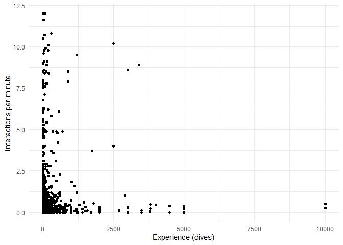

# Data Exploration

### Code only

[**Go to Project Summary**](../readme.md)

``` r
library(readr)
library(tidyr)
library(dplyr)
library(ggplot2)

cat("libraries loaded\n")

location <- read_rds("../clean-data/location_clean.rds")
behavior <- read_rds("../clean-data/behavior_clean.rds")

cat("data loaded")
```

    ## libraries loaded
    ## data loaded

``` r
# join tables by diver_id and move source column to the end
reef <- inner_join(location, behavior, by = "diver_id") %>%
  select(-source, everything(), source)
```

``` r
reef %>%
  filter(experience < 400) %>%  # filter for less than 400 dives
  ggplot(aes(x = experience)) +  # set experience to the x-axis
  # set chart type and the number of bins and color
  geom_histogram(bins = 80, fill = "darkblue", ) +
  facet_wrap(~country) +  # facet by country
  labs(
    title = "Histograms of Experience by Country",  # add labels
    x = "Experience (dives)",
    y = "Frequency\n"
  ) +
  theme_minimal() +  # add minimal theme
  theme(plot.title = element_text(hjust = 0.5))  # centralize title
```

<!-- -->

``` r
# drop fields that I don't care about for this analysis
reef_exp <- reef %>%
  select(
    -country, -site, -latitude, -longitude, -dive_site, -year, -month,
    -gender, -reef_type, -damage, -contact, -source
  )
```

``` r
# count observations for each activity type
cat("number of snorkeling observations:\n")
nrow(reef_exp %>% filter(activity == "snorkeling"))

cat("number of scuba observations:\n")
nrow(reef_exp %>% filter(activity == "scuba"))

cat("\n")

# check sources for snorkeling data
reef %>%
  filter(activity == "snorkeling") %>%
  group_by(source, year, month) %>%
  tally()
```

    ## number of snorkeling observations:
    ## [1] 151
    ## number of scuba observations:
    ## [1] 1875
    ## 
    ## # A tibble: 3 × 4
    ## # Groups:   source, year [3]
    ##   source             year month        n
    ##   <chr>             <dbl> <fct>    <int>
    ## 1 renfro_bobbie      2023 may          6
    ## 2 saliba_et_al_2022  2015 december   107
    ## 3 saliba_et_al_2022  2016 january     38

``` r
reef_exp %>%
  group_by(activity) %>%  # start by grouping by activity
  # calculate desired statistics
  summarize(
    # mean for interactions per minute
    mean_int = mean(interactions_per_min),
    # standard deviation for interactions per minute
    sd_int = sd(interactions_per_min),
    median = median(interactions_per_min)
  )
```

    ## # A tibble: 2 × 4
    ##   activity   mean_int sd_int median
    ##   <fct>         <dbl>  <dbl>  <dbl>
    ## 1 scuba         0.682  1.50    0.15
    ## 2 snorkeling    0.418  0.749   0

``` r
reef_exp %>%
  ggplot(aes(x = interactions_per_min)) +
  geom_histogram(bins = 100, fill = "darkblue") +
  labs(
    title = "Histogram of Interactions per Minute",
    x = "\nInteractions per Minute",
    y = "Frequency\n"
  ) +
  theme_minimal() +
  theme(plot.title = element_text(hjust = 0.5))
```

<!-- -->

``` r
# select only observations from scuba diving
reef_scuba <- reef_exp %>%
  filter(activity == "scuba")

# calculate desired statistics for interactions_per_min
reef_scuba %>% summarize(
  # mean interactions per minute
  mean_int = mean(interactions_per_min),
  # percentage below mean:
  # creates a vector with TRUE for every value below the mean and
  # mean() calculates the ratio of TRUE to FALSE
  int_below_mean = mean(interactions_per_min < mean_int) * 100,
  # first quartile
  first_quartile = quantile(interactions_per_min, probs = 0.25),
  # median
  median = median(interactions_per_min),
  # second quartile
  third_quartile = quantile(interactions_per_min, probs = 0.75),
  # percentage of interactions_per_min that are zero
  int_zero = sum(interactions_per_min == 0) /
    sum(!is.na(interactions_per_min)) * 100
)
```

    ## # A tibble: 1 × 6
    ##   mean_int int_below_mean first_quartile median third_quartile int_zero
    ##      <dbl>          <dbl>          <dbl>  <dbl>          <dbl>    <dbl>
    ## 1    0.682           75.3              0   0.15          0.655     30.8

``` r
reef_scuba %>%
  group_by(mpa) %>%  # group by mpa factor
  # calculate desired statistics
  summarize(
    count = n(),  # count number of observations
    mean_int = mean(interactions_per_min),
    first_quartile = quantile(interactions_per_min, probs = 0.25),
    median = median(interactions_per_min),
    third_quartile = quantile(interactions_per_min, probs = 0.75),
    int_zero = sum(interactions_per_min == 0) /
      sum(!is.na(interactions_per_min)) * 100
  )
```

    ## # A tibble: 2 × 7
    ##   mpa   count mean_int first_quartile median third_quartile int_zero
    ##   <fct> <int>    <dbl>          <dbl>  <dbl>          <dbl>    <dbl>
    ## 1 no      159    0.244              0  0.05             0.2     40.9
    ## 2 yes    1716    0.723              0  0.174            0.7     29.8

``` r
reef_scuba %>%
  # mpa factor on x-axis, interactions on y-axis, color by mpa
  ggplot(aes(x = mpa, y = interactions_per_min, fill = mpa)) +
  # boxplot of interactions per min for each mpa factor level
  geom_boxplot() +
  stat_summary(  # plot the mean for each mpa factor level
    fun = mean,  # set mean as statistic to be used
    geom = "errorbar",  # set type of geom
    width = 0.5,  # set length of error bars (horizontal)
    color = "red",  # set color
    linewidth = 1,  # set width of the line
    # set both ends of the error bar at the mean
    aes(ymin = after_stat(y), ymax = after_stat(y))
  ) +
  labs(
    x = "MPA",  # change x and y axes titles
    y = "Interactions per minute\n"
  ) +
  theme_minimal() +  # add minimal theme
  theme(  # change size of title and labels for x and y axes
    axis.title.y = element_text(size = 13),
    axis.title.x = element_text(size = 13),
    axis.text.y = element_text(size = 11),
    axis.text.x = element_text(size = 11),
    legend.position = "none"  # remove legend
  ) +
  coord_cartesian(ylim = c(0, 2)) +  # zoom in area of interest
  # display "mean" inside chart
  annotate("text",
    x = 1.1, y = .31, label = "mean",
    color = "red", fontface = "bold"
  ) +
  annotate("text",
    x = 2.1, y = .79, label = "mean",
    color = "red", fontface = "bold"
  )
```

<!-- -->

``` r
# drop rows with NA values in experience
reef_scb_xp <- reef_scuba %>%
  drop_na(experience)

# scatter plot to visualize relationship of variables
reef_scb_xp %>%
  # set experience on x-axis and interactions on y-axis
  ggplot(aes(x = experience, y = interactions_per_min)) +
  geom_point() +  # choose scatter plot display
  labs(
    x = "Experience (dives)",
    y = "Interactions per minute"
  ) +
  theme_minimal()

# calculate correlation between variables
cor_xp_int <- cor(reef_scb_xp$experience, reef_scb_xp$interactions_per_min)
cat("correlation: ", cor_xp_int)  # show result
```

    ## correlation:  0.02950467

<!-- -->

``` r
reef_scb_xp_one_k <- reef_scb_xp %>%
  filter(experience < 1000)

reef_scb_xp_one_k %>%
  ggplot(aes(x = experience, y = interactions_per_min)) +
  geom_point() +
  labs(
    x = "Experience (dives)",
    y = "Interactions per minute"
  ) +
  theme_minimal()

cor_xp1k_int <-
  cor(reef_scb_xp_one_k$experience,
      reef_scb_xp_one_k$interactions_per_min)
cat("correlation: ", cor_xp1k_int)
```

    ## correlation:  0.01906696

<!-- -->

``` r
reef_scb_xp_one_hundred <- reef_scb_xp %>%
  filter(experience < 100)

reef_scb_xp_one_hundred %>%
  ggplot(aes(x = experience, y = interactions_per_min)) +
  geom_point() +
  labs(
    x = "Experience (dives)",
    y = "Interactions per minute"
  ) +
  theme_minimal()

cor_xp100_int <-
  cor(reef_scb_xp_one_hundred$experience,
      reef_scb_xp_one_hundred$interactions_per_min)
cat("correlation: ", cor_xp100_int)
```

    ## correlation:  -0.03127119

<!-- -->

``` r
# deal with NAs
reef_scb_cam <- reef_scuba %>%
  drop_na(camera)

# calculate summary statistics
reef_scb_cam %>%
  group_by(camera) %>%
  summarize(
    # count number of observations
    count = n(),
    # mean interactions per minute
    mean_int = mean(interactions_per_min),
    # first quartile
    first_quartile = quantile(interactions_per_min, probs = 0.25),
    # median
    median = median(interactions_per_min),
    # third quartile
    third_quartile = quantile(interactions_per_min, probs = 0.75),
    # percentage of interactions_per_min that are zero
    int_zero = sum(interactions_per_min == 0) /
      sum(!is.na(interactions_per_min)) * 100
  )

# plot summary statistics
reef_scb_cam %>%
  ggplot(aes(x = camera, y = interactions_per_min, fill = camera)) +
  # boxplot of interactions per min for each camera factor level
  geom_boxplot() +
  stat_summary(  # plot the mean for each camera factor level
    fun = mean,  # set mean as statistic to be used
    geom = "errorbar",  # set type of geom
    width = 0.5,  # set length of error bars (horizontal)
    color = "red",  # set color
    linewidth = 1,  # set width of the line
    # set both ends of the error bar at the mean
    aes(ymin = after_stat(y), ymax = after_stat(y))
  ) +
  labs(
    x = "Camera",  # change x and y axes titles
    y = "Interactions per minute\n"
  ) +
  theme_minimal() +  # add minimal theme
  theme(  # change size of title and labels for x and y axes
    axis.title.y = element_text(size = 13),
    axis.title.x = element_text(size = 13),
    axis.text.y = element_text(size = 11),
    axis.text.x = element_text(size = 11),
    legend.position = "none"  # remove legend
  ) +
  coord_cartesian(ylim = c(0, 2)) +  # zoom in area of interest
  # display "mean" inside chart
  annotate("text",
    x = 1.1, y = .82, label = "mean",
    color = "red", fontface = "bold"
  ) +
  annotate("text",
    x = 2.1, y = .57, label = "mean",
    color = "red", fontface = "bold"
  )
```

    ## # A tibble: 2 × 7
    ##   camera count mean_int first_quartile median third_quartile int_zero
    ##   <fct>  <int>    <dbl>          <dbl>  <dbl>          <dbl>    <dbl>
    ## 1 no      1234    0.751              0  0.12             0.7     33.1
    ## 2 yes      604    0.500              0  0.184            0.5     28.0

<!-- -->

``` r
# drop rows with NA values for visibility
reef_scb_viz <- reef_scuba %>%
  drop_na(visibility_m)

# scatter plot to visualize relationship of variables
reef_scb_viz %>%
  ggplot(aes(x = visibility_m, y = interactions_per_min)) +
  geom_point() +
  labs(
    x = "Visibility (m)",
    y = "Interactions per minute"
  ) +
  theme_minimal()

# plot histogram to see distribution of observations
reef_scb_viz %>%
  ggplot(aes(x = visibility_m)) +
  geom_bar(fill = "black") + # bar plot to count for each visibility_m
  labs(
    x = "Visibility (m)",
    y = "Frequency of observations"
  ) +
  theme_minimal() +
  scale_x_continuous(breaks = c(0,5,10,15,20,25,30))  # set breaks on x-axis

# calculate correlation between variables
cor_viz <- cor(reef_scb_viz$visibility_m, reef_scb_viz$interactions_per_min)
cat("correlation: ", cor_viz)
```

    ## correlation:  0.07586902


``` r
# filter the top 10% of interactions per min
reef_scuba %>%
  filter(interactions_per_min >= quantile(interactions_per_min, probs = 0.9)) %>%
  summary()
```

    ##     diver_id            activity    mpa       visibility_m     experience    
    ##  Min.   :  10.0   scuba     :192   no :  6   Min.   : 5.00   Min.   :   1.0  
    ##  1st Qu.: 223.8   snorkeling:  0   yes:186   1st Qu.:13.00   1st Qu.:   8.0  
    ##  Median : 322.5                              Median :15.00   Median :  32.5  
    ##  Mean   : 539.7                              Mean   :13.37   Mean   : 211.2  
    ##  3rd Qu.: 500.0                              3rd Qu.:15.00   3rd Qu.: 150.0  
    ##  Max.   :1856.0                              Max.   :15.00   Max.   :3400.0  
    ##                                              NA's   :173     NA's   :52      
    ##   camera    samp_time_min   total_interactions interactions_per_min
    ##  no  :149   Min.   : 5.00   Min.   : 10.00     Min.   : 1.700      
    ##  yes : 34   1st Qu.:10.00   1st Qu.: 22.00     1st Qu.: 2.175      
    ##  NA's:  9   Median :10.00   Median : 32.00     Median : 2.900      
    ##             Mean   :12.31   Mean   : 49.15     Mean   : 4.169      
    ##             3rd Qu.:10.00   3rd Qu.: 64.25     3rd Qu.: 5.400      
    ##             Max.   :50.00   Max.   :274.00     Max.   :12.000      
    ## 

[**Go to Project Summary**](../readme.md)
